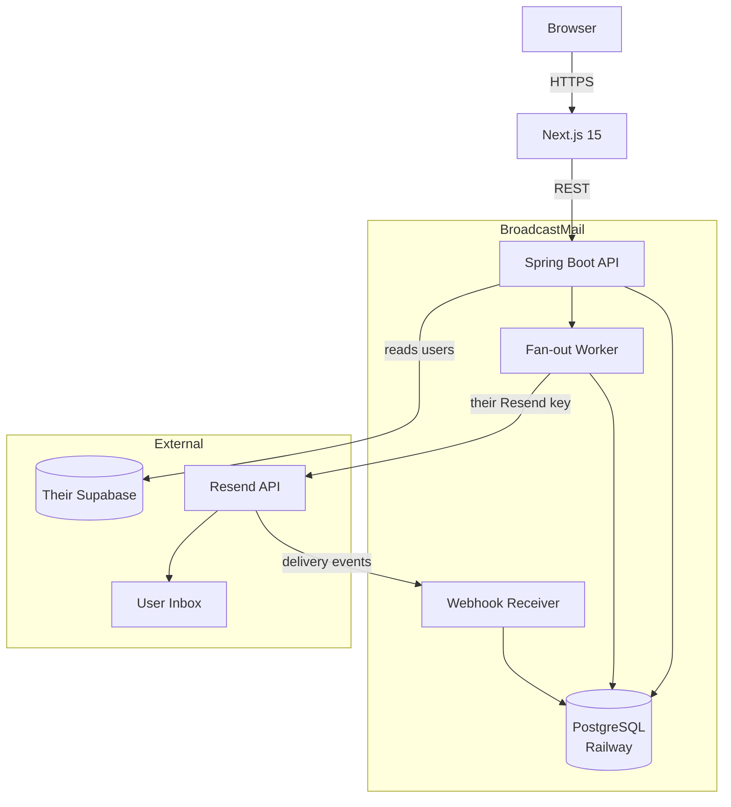

# BroadcastMail

Email your Supabase users in 60 seconds.

No CSV export. No Mailchimp. Connect your database, compose, send.
Uses your own Resend account — you own deliverability, we never charge per email.

**[broadcastmail.io](https://broadcastmail.io)** · [Docs](https://broadcastmail.io/docs) · [Report a bug](https://github.com/lakiivnovic/broadcastmail/issues/new?template=bug_report.md)

---

## Architecture



---

## How It Works

1. Connect your Supabase project via OAuth — we create a read-only role automatically
2. Connect your Resend account — you own sending reputation, we never touch it
3. Compose a campaign, pick recipients (all users or a filtered segment)
4. Confirm — recipients are snapshotted, fan-out worker sends via your Resend key
5. Track delivery: sent / delivered / opened / bounced per recipient

---

## Tech Stack

| Layer | Technology                                              |
|---|---------------------------------------------------------|
| Frontend | Next.js 16, TypeScript, Tailwind, Shadcn/ui             |
| Backend | Spring Boot (Java 25), Spring Data JPA, Spring Security |
| Database | PostgreSQL on Railway, Flyway migrations                |
| Email | Resend (bring your own key)                             |
| Auth | API key auth + Supabase Management API OAuth            |
| Deploy | Railway                                                 |

---

## Local Setup

**Prerequisites:** Java 21+, Maven, a Railway Postgres instance, a Resend account

```bash
# Clone
git clone https://github.com/lakiivnovic/broadcastmail.git
cd broadcastmail

# Copy env file and fill in your Railway credentials
cp .env.example .env

# Run Flyway migrations
mvn flyway:migrate

# Start API server
mvn spring-boot:run
```

Frontend setup:
```bash
cd frontend
npm install
npm run dev
```

---

## Environment Variables

```bash
# Railway Postgres
PGHOST=
PGPORT=5432
PGDATABASE=railway
PGUSER=postgres
PGPASSWORD=

# Encryption
ENCRYPTION_KEY=        # 32 character random string

# Supabase Management API OAuth
SUPABASE_CLIENT_ID=
SUPABASE_CLIENT_SECRET=

# Stripe
STRIPE_SECRET_KEY=
STRIPE_WEBHOOK_SECRET=
```

---

## Pricing

| | Free      | Pro $9/mo |
|---|-----------|---|
| Campaigns | Unlimited | Unlimited |
| Recipients per campaign | 300       | Unlimited |
| Unique recipients per 30 days | 500       | Unlimited |
| Filters / segments | x         | ✓ |
| Scheduling | x         | ✓ |
| History | 7 days    | 90 days |

---

## Documentation

- [DATABASE.md](DATABASE.md) — schema design, access patterns, scaling strategy

---

## Project Status

V1 in active development. Target launch: August 22, 2026.

| Feature | Status      |
|---|-------------|
| DB schema + Flyway | Done    |
| Supabase OAuth connection | In progress |
| Schema introspection | Planned     |
| Campaign CRUD |  Planned   |
| Fan-out worker |  Planned   |
| Delivery tracking |  Planned   |
| Frontend dashboard |  Planned   |
| Stripe billing |  Planned   |

---

## License

MIT